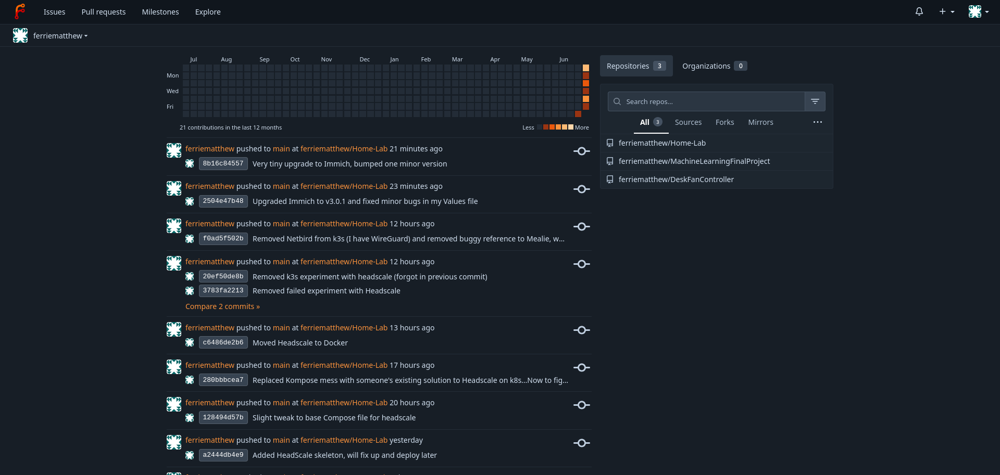
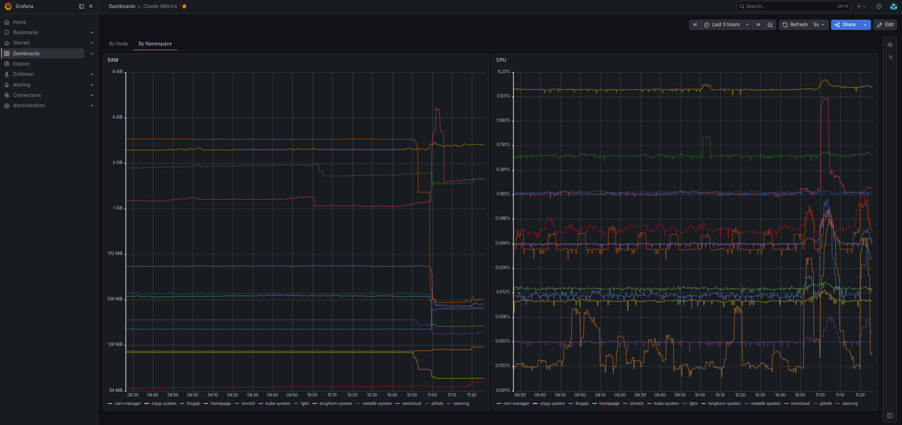
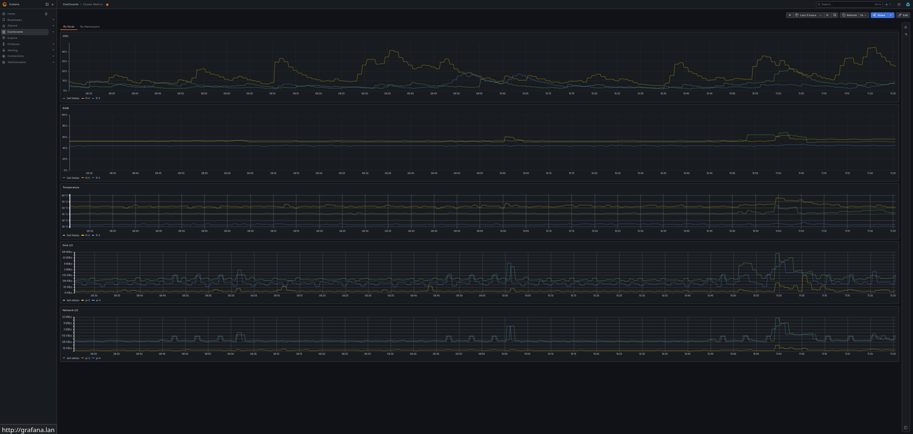
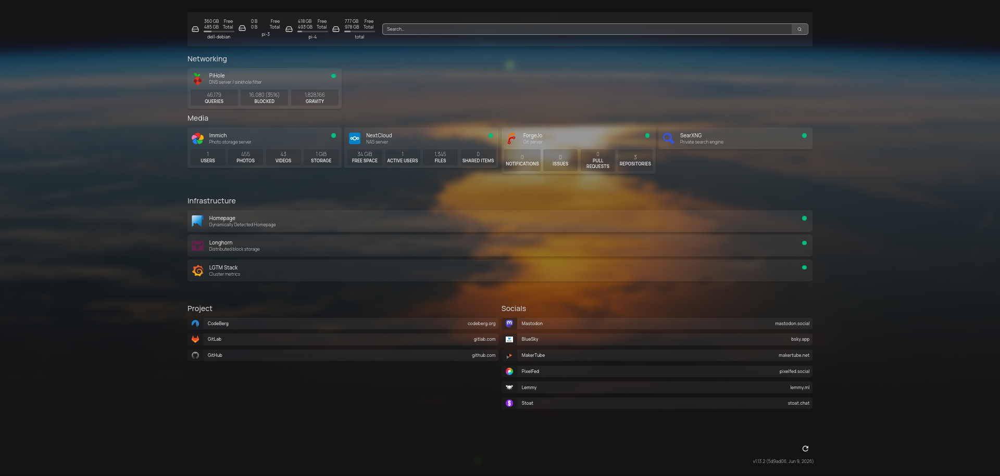
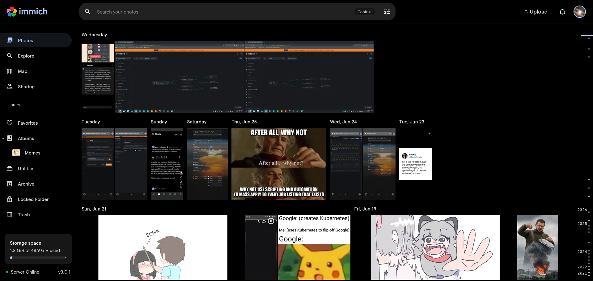
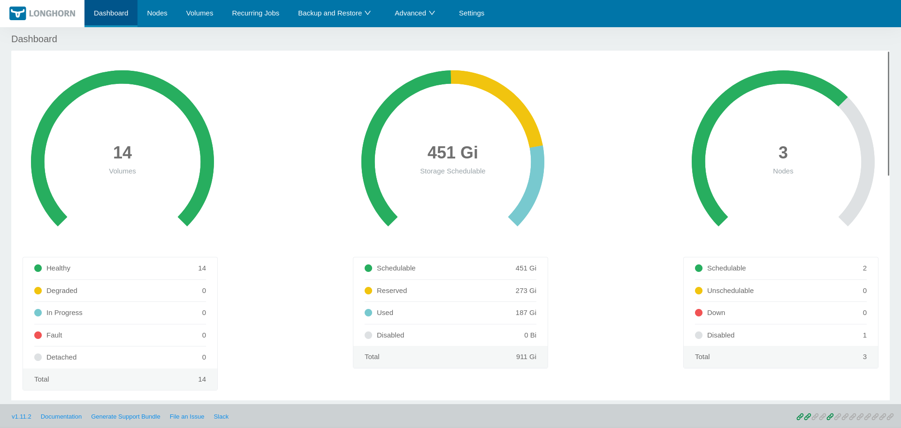
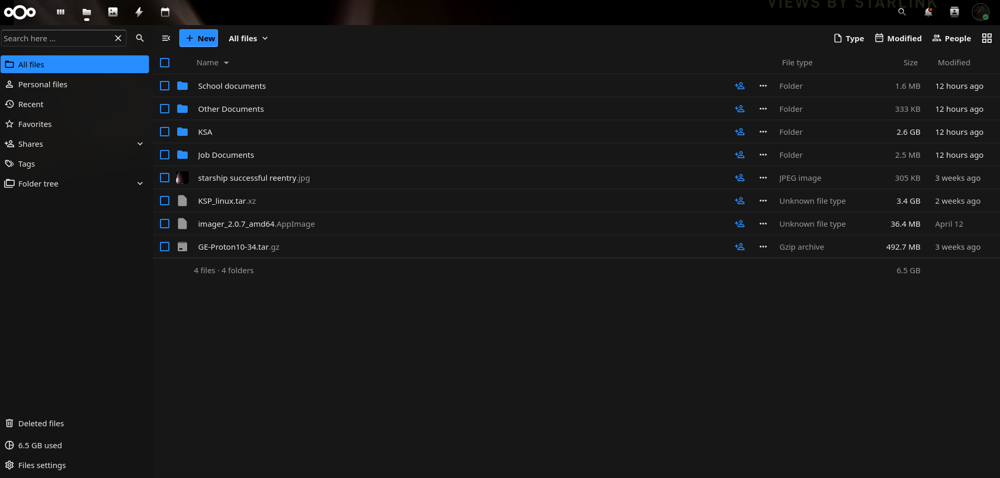
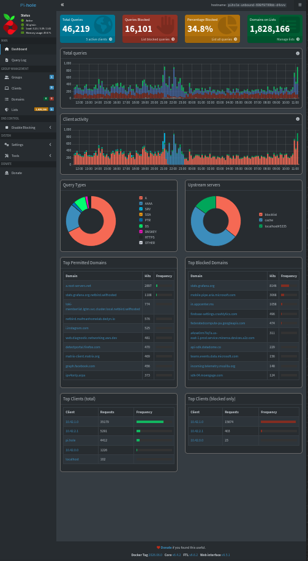

## Overview
I'm self-hosting several services on two Raspberry Pi's and one Dell Latitude 7490 to improve my digital sovereignty and reduce third-party costs.

## Goals
- Photo storage
- File storage
- VPN server
- DNS server + sinkhole
- Dashboard

## Constraints
The Raspberry Pi 3 uses an SD card for system storage, so it is unsuitable as a distributed filesystem host

The architecture mismatch between the Raspberry Pis (ARM 64) and the laptop (AMD64) necessitates multi-architecture container images or use of deployment constraints

## Tools
- Docker Compose
- Git for version control
- k3s for orchestration
- Longhorn for distributed storage

## Screenshots

